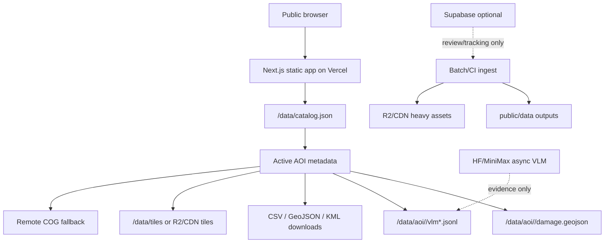

# Audit 2026: Mobile Map Performance And Crisis Safety

## Executive Summary

The app already follows the most important architectural direction: the public route is static-first, loads `catalog.json`, and then fetches only the active AOI damage/VLM layers in `src/components/OperationsConsole.tsx`. The main production risks are not the React data flow itself; they are deploy/package pressure, imagery fallback behavior, weak CI gates, analytics privacy defaults, and missing visible failure states for poor mobile networks.

Baseline observed during this audit:

- `public/data`: 308.1 MB by summed file bytes.
- `public/data/tiles`: 186.0 MB, 73,837 tile files.
- `public/data/chips`: 67.3 MB, 681 chip files.
- `public/data/catalog.json`: 61.3 KB, 15 AOIs.
- Largest local public files include `external-msft-catia-la-mar-predicted-damage/damage.kml` at 16.2 MB, AOI12 EMS PDF at 10.9 MB, and `external-msft-catia-la-mar-predicted-damage/damage.geojson` at 8.6 MB.

## Top Risks

### P0

1. Raw production package can include hundreds of MB of local public assets. `README.md:47` and `docs/DEPLOYMENT_CHECKLIST.md:20` say large rasters/chips/tiles should stay out of Vercel, but the checked-out `public/data/tiles` and `public/data/chips` are large enough to make a raw deploy fragile. Use `scripts/build_vercel_remote_asset_package.py` plus remote validation before production deploys.
2. Browser-side COG fallback can become a full or slow remote raster path if tiled imagery is absent or fails. `src/components/map/MapPanel.tsx:415` and `src/components/map/MapPanel.tsx:445` instantiate `GeoTIFF` sources directly from `beforeImage`/`afterImage`; catalog COG URLs are in `public/data/catalog.json:43`, `216`, `302`, `391`, `551`, `710`, and `801`.
3. Analytics privacy defaults were too permissive at audit start: `src/components/OpenPanelAnalytics.tsx:17-19` enabled screen views, outgoing-link tracking, and attribute tracking. Outgoing links can expose full Google Maps/chip/download URLs, contrary to `docs/ANALYTICS.md:18-20`.
4. External prediction data is large and operationally sensitive. `public/data/catalog.json:965-997` publishes the Catia La Mar Microsoft/HDX prediction layer with 9,134 features. It is labeled external prediction, but any future UI/analytics/reporting must keep it out of official EMS counts.

### P1

5. AOI layer failures were silent at audit start. `src/components/OperationsConsole.tsx:394-410` and `419-448` caught VLM/damage failures but did not expose an operator-facing error state.
6. Mobile CSS hid downloads on narrow screens at audit start. `src/app/globals.css:138` hid `.downloads-section`, which undermines the low-bandwidth fallback when imagery/vector loading fails.
7. Existing service worker intentionally unregisters itself and deletes caches in `public/sw.js:7-11`. That avoids stale caches but means there is no offline/light-mode cache strategy yet.
8. There was no general CI for lint/typecheck/build/data validation. Existing workflows were ingest/monitor oriented: `.github/workflows/monitor-emsr884.yml`, `manual-ingest.yml`, `seed-vlm-queue.yml`, and `sync-vantor-to-r2.yml`.
9. No explicit `typecheck` script existed at audit start in `package.json:5-10`.
10. Remote asset validation now checks sampled tile/chip HTTP status, content type, cache headers, and sampled COG Range support, but production remote-asset deploys still need a full or representative high-zoom sample before pruning local assets; see `scripts/validate_remote_asset_urls.py`.

### P2

11. `AGENTS.md` only contained the Next.js warning at audit start, so future agents lacked crisis-response guardrails.
12. Operational docs existed but were split across deployment, analytics, infrastructure, and handoff files without one budget/validation runbook.
13. Mobile automated QA only covered one narrow 390 px smoke path at audit start. It now covers 360, 430, and 768 px low-bandwidth essentials plus active AOI damage/VLM failure, but physical-device and Core Web Vitals validation remain manual.

## Architecture Map

## Load Flows

### Initial Load

1. `src/app/page.tsx` renders `ClientConsole`.
2. `src/components/ClientConsole.tsx:5-8` dynamically imports `OperationsConsole` with SSR disabled.
3. `OperationsConsole` fetches `/data/catalog.json`.
4. AOI navigation, metadata, KPIs, and downloads can render from the catalog before non-active AOI vectors are fetched.

### AOI Selection

1. User clicks a city/AOI button in `src/components/OperationsConsole.tsx:607-611`.
2. `selectAoi` updates `activeId`, clears selection, and increments focus tokens.
3. Effects fetch only the active AOI `layers.damage` and `layers.vlm`.
4. `MapPanel` fits the AOI bounds and renders active AOI features.

### Before/After Imagery

1. `MapPanel` prefers tile templates when `beforeTiles`/`afterTiles` exist.
2. If tiles are absent, it creates `GeoTIFF` sources from `beforeImage`/`afterImage`.
3. Approximate external aerial reference is only a visual reference layer and must not become evidence.

### VLM/Evidence

1. VLM JSONL is fetched lazily for active AOI only.
2. Evidence chips are opened only when a feature is selected.
3. Before/after VLM requires chip and source metadata; post-event-only VLM stays separate.

### Downloads

Downloads are static catalog links under each AOI. They must stay usable even when imagery or vector layers fail.

### Deployment

Raw source app can run locally with bundled assets. Production should use `scripts/validate_remote_asset_urls.py` and `scripts/build_vercel_remote_asset_package.py` when tiles/chips are mirrored to R2/CDN.

## Risk Detail

### Data And Overclaiming

- External prediction AOIs are labeled `external-prediction` in `public/data/catalog.json:972`, `1028`, `1091`, and `1154`.
- `docs/ANALYTICS.md:72-75` correctly warns that analytics usage is not damage validation.
- `scripts/validate_vlm_publication_guardrails.py` already protects before/after and post-event-only VLM labels.

### Repo Size / Vercel Package

- `scripts/build_vercel_remote_asset_package.py:37-40` excludes `public/data/tiles` and `public/data/chips` from a pruned package.
- `docs/DEPLOYMENT_CHECKLIST.md:22-30` documents the remote-asset package flow.
- New `scripts/audit_asset_budget.py` measures current pressure and writes `ops/performance_audit/latest.md`.

### Connectivity

- The current lazy active-AOI flow avoids the worst all-AOI initial download.
- Missing pieces are explicit low-bandwidth mode, tile placeholder/progressive UX, and a service-worker strategy limited to owned assets.

### Accessibility

- At audit start, map controls were buttons but lacked consistent `aria-pressed` state and some labels.
- Focus styling and mobile touch target improvements were needed in `src/app/globals.css`.

### CI/CD

- Existing ingest workflows can open PRs but did not run app/data gates.
- New CI should separate local deterministic gates from flaky remote URL checks.

## Quick Wins Implemented In This Work

- Added `typecheck`, asset audit, catalog validation, mobile budget, and e2e npm scripts.
- Added catalog schema/guardrail validation.
- Added mobile performance budget validation.
- Added public-data text scanning for local absolute paths and secret-looking strings.
- Extended remote asset validation to check tile/chip content types, immutable cache headers, and COG byte-range behavior.
- Rebuilt `AGENTS.md` as the canonical agent control document.
- Added Copilot/Cursor instructions.
- Added CI workflows for build/data/performance/e2e/remote assets.
- Adjusted analytics defaults to be opt-in and disable automatic outgoing-link tracking.
- Added AOI data loading/error status and mobile fallback visibility.
- Added Playwright coverage for 360, 430, and 768 px viewport essentials with raster stubs, plus a 360 px damage/VLM failure fallback check for active AOI metadata, mobile operational brief, and downloads.

## Larger Follow-Up PRs

- Introduce a real light-mode route or UI state backed by `catalog.min.json`/`index.json`.
- Split very large external prediction GeoJSON/KML into summary plus on-demand vector tiles or FlatGeobuf.
- Add tile placeholder/progressive UX and stronger first-tile failure reporting.
- Validate R2/CDN cache and content-type headers across representative high-zoom tiles.
- Add a carefully scoped service worker for app shell, catalog minimum, AOI metadata, and owned static exports only.
- Consider worker-based GeoJSON/JSONL parsing if AOI feature counts or external predictions continue to grow.
- Add a production-like Core Web Vitals gate or recurring report for 360 px mobile, including LCP, CLS, INP, transferred bytes before first useful AOI context, and cold/warm cache comparisons.
- Run manual QA on modest Android hardware or emulator under throttled Fast 3G/Slow 3G before launch and after any heavy imagery/tile change.
